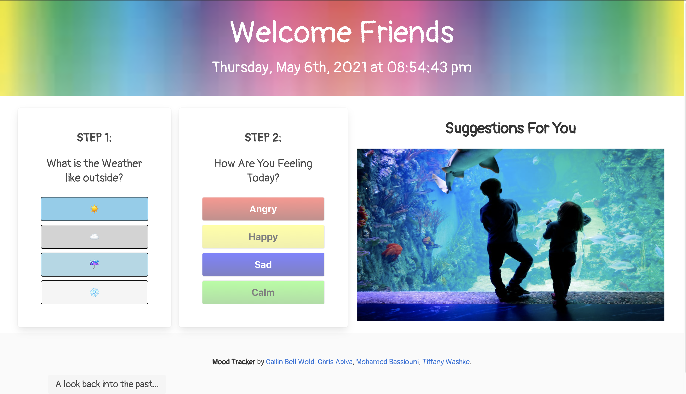
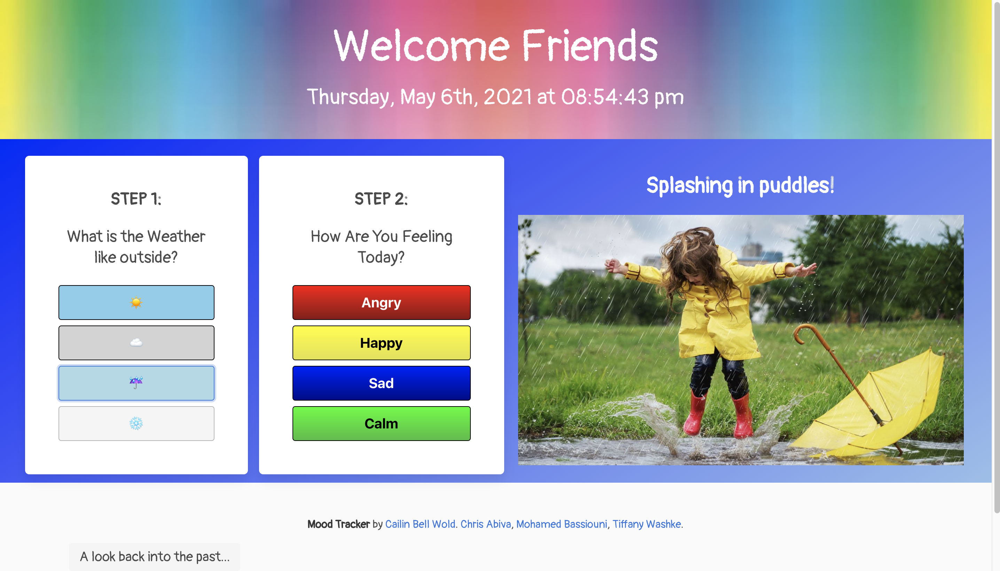

# Project 1: Mood Tracker

The Mood Tracker is a tool for welcoming kids into a new virtual space and checking in with how they are feeling.  Depending on the weather selection and the feeling chosen, they will receive several minutes of content curated for their mood.  If the user (or parent of the user) wants to see the past results, there is "A Look into the past..." section that shows the date, the mood chosen, and the weather on that day.

## Table of Contents 

- [About the Project](#about-the-project)
- [Installation](#installation)
- [Usage](#usage)
- [Credit](#credit)
- [License](#license)

## About the Project

- The motivation for this project is to support young people in their journey toward emotional maturity by allowing them the oppurtiuunity to develop self-awareness around their own emotional states.
- Built with the following technologies:
    - [Bulma](https://bulma.io/) - CSS Framework 
    - [bulma-debug.css](https://gist.github.com/JuanVqz/105c4910ff711659059c99492ecd1a5c) used to debug CSS layout
    - [Animista](https://animista.net/play/basic) - CSS Animations 
    - [Google Fonts](https://fonts.google.com/)
    - [jQuery](https://jquery.com/)
    - [Moments.js](https://momentjs.com/)
    - [GIPHY](https://developers.giphy.com/docs/api/) API
    - [jokeapi](https://sv443.net/jokeapi/v2/) API
    - [favqs](https://public-apis.xyz/favqs-com-2032) API
    - HTML, CSS, and Javascript
- When a weather button is clicked, the data is stored in local storage and the background color and image change, providing a suggestion for what could be done in that weather.
- Once a weather option has been chosen, the user can choose their mood by clicking on one of the four emotions (Angry, Happy, Sad, Calm), the data is stored in local storage and it will bring up a GIPHY and a pun, joke, or quote depending on the emotion chosen.
- The user can cycle through more content of the same emotion chosen by clicking the Next button, or they can close it out and start again.
- **A Look into the past...** section is available for the user to review past selections (date, mood, and weather) from the inputs saved to local storage.

## Installation

- Open [Mood Tracker](https://chabivz.github.io/Daily-Checkins/) 
- Or, open index.html in the internet browser.

## Usage

- Go to [Mood Tracker](https://chabivz.github.io/Daily-Checkins/)
- Look outside and refer to Step 1 to choose what the weather is like by pressing the weather emoji that best fits.
- Check out the suggestions on the right for what you could do in that weather.
- For Step 2 click a button that represents how you are feeling today.
- This will bring up a GIPHY for the emotion chosen as well as either a pun, a joke, or quote (depending on the mood chosen).
- Click the Next button to bring up another image and text for the same emotion chosen.
- Use the exit out button in the top right corner to restore the page and choose the weather and emotion again.
- To review past emotions, click the **A look back into the past...** button to see past results of date, mood, and weather.
- To remove the past results click the Clear button.
- To return to the Mood Tracker click the Go Back button.

Mood Tracker Demo \
 \
\
Welcome Friends Mood Tracker \
 \
\
Sunny Day Chosen \
 \
\
Rainy Day Chosen \
 \
\
A look back into the past...\
 

## Credit

- [Cailin Bell Wold](https://github.com/CailinBellWold)
- [Chris Abiva](https://github.com/Chabivz)
- [Mohamed Bassiouni](https://github.com/MohamedB-01)
- [Tiffany Washke](https://github.com/twashke)

## License

- No license for this project.